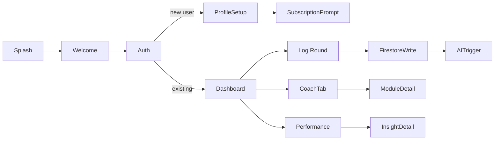

# FoCoCo App Developer Blueprint

> Focus. Confidence. Control. – A detailed, implementable specification for rapid UI/UX development.

---

## Table of Contents

1. [Introduction & Core Principles](#introduction--core-principles)
2. [User Roles & Access Levels](#user-roles--access-levels)
3. [Technology Stack](#technology-stack)
4. [Frontend Architecture](#frontend-architecture)
   - [Navigation Structure](#navigation-structure)
   - [Screen Flows & User Interactions](#screen-flows--user-interactions)
   - [UI Components & Widgets](#ui-components--widgets)
5. [Backend Architecture](#backend-architecture)
   - [Authentication](#authentication)
   - [Firestore Data Schema](#firestore-data-schema)
   - [Security Rules](#security-rules)
   - [Cloud Storage](#cloud-storage)
   - [Cloud Functions & Triggers](#cloud-functions--triggers)
6. [Integrations](#integrations)
   - [In‑App Purchases (IAP)](#in‑app-purchases-iap)
   - [AI Insights (OpenAI)](#ai-insights-openai)
   - [Analytics & Notifications](#analytics--notifications)
7. [UX Flow Summary](#ux-flow-summary)
8. [Future Enhancements](#future-enhancements)
9. [Deployment & CI/CD](#deployment--cicd)
10. [Collaboration & Version Control](#collaboration--version-control)
11. [Notes & Minor Improvements](#notes--minor-improvements)

---

## Introduction & Core Principles

- **Mission**: Democratize mental performance coaching for everyday golfers via VARK‑adapted AI modules and data journaling fileciteturn1file3.
- **Scalability**: Architect to support ≥10,000 MAUs with cost‑efficient Firebase usage fileciteturn1file0.
- **Performance**: Native‑grade responsiveness delivered through FlutterFlow UI flows fileciteturn1file0.
- **Security**: Strict Firebase Auth, Firestore rules, and server‑side IAP receipt validation.
- **Modularity**: Clear separation: UI widgets, state/business logic (FlutterFlow custom functions), backend (Cloud Functions).
- **Extensibility**: Plug‑in architecture for future sports (tennis, etc.) using the same domain‑agnostic mental coaching engine.

## User Roles & Access Levels

| Tier   | BASE                        | PLUS                               | PRIME                                   |
| ------ | --------------------------- | ---------------------------------- | --------------------------------------- |
| Access | Basic modules, stat logging | +Advanced modules, trend analytics | +Premium content, unlimited AI insights |
| AI     | 1 insight/round             | 2 insights/round                   | Unlimited + token system                |
| VARK   | Personalized filters        | All BASE + module grouping by tier | All PLUS + token‑based AI packs         |

## Technology Stack

- **Frontend**: FlutterFlow (Dart) for rapid UI prototyping and production builds.
- **Backend**: Firebase Auth, Firestore, Cloud Functions, Storage.
- **AI**: OpenAI API (via secure Cloud Functions) for insights generation.
- **IAP**: Apple StoreKit & Google Play Billing (client) + server validation.
- **CI/CD**: FlutterFlow builds + Firebase CLI; optional Fastlane for automation.

## Frontend Architecture

### Navigation Structure

- **Bottom Nav Bar (4 tabs)**: Home (Dashboard), Log Round (FAB), Coach, Performance.
- **Drawer**: Profile, Settings, FAQ, Support, Privacy & Terms, Logout.
- **Stack Nav**: Modal/detail screens (Auth, Round Detail, Module Detail).

### Screen Flows & User Interactions



1. **Onboarding & Auth**: Splash → Welcome carousel → Sign Up / Login (with Email, Google, Apple) → Profile Setup (handicap, VARK quiz) → Subscription prompt fileciteturn1file2.
2. **Subscription**: Pricing comparison → native purchase → send receipt to `verifyIAPPurchase` CF → update Firestore → success/failure screen fileciteturn1file0.
3. **Log Round**: NewRound screen with form fields (date, course, stats, journal) → save to `golf_rounds` → trigger `generateAIInsights` CF → update `ai_insights` and Firestore flag fileciteturn1file0.
4. **Coach Tab**: List `coaching_modules` filtered by user VARK and tier → ModuleDetail → video/audio/text sections → mark complete → optional journaling.
5. **Performance**: Charts (handicap trend, stat averages, coaching streaks) using `golf_rounds`, `mental_sessions`, `ai_insights` data.
6. **Profile & Settings**: Editable name, photo, VARK prefs; GDPR tools; notification toggles.

### UI Components & Widgets

- **CustomTextField**: Themed input with validation.
- **CustomButton**: Primary/Secondary/Outlined.
- **DataCard**: Summary displays (handicap, last insight).
- **ChartWidget**: LineChart, BarChart (Handicap trends, stat breakdowns).
- **VideoPlayer** / **AudioPlayer**: Embedded media.
- **JournalEntryDisplay**: Rich text viewer.
- **AlertDialog** / **Snackbar**: Error/info feedback.
- **LoadingSpinner**: Global loader for API calls.

## Visual Identity & Design System

### I. Color Application Rules

Use these design tokens consistently throughout FoCoCo:

| Use Case                     | Token Name    | Hex     | Notes                                            |
| ---------------------------- | ------------- | ------- | ------------------------------------------------ |
| Primary Action (CTAs, FABs)  | FoCoCo Blue   | #0A2A4E | High-contrast core decisions (e.g., "Log Round") |
| Secondary Action             | FoCoCo Green  | #3B7F5F | Supportive actions (e.g., "Edit Profile")        |
| Highlight / Reward / Success | FoCoCo Gold   | #E0A800 | Unlocks, milestones, positive feedback only      |
| Background                   | Surface White | #FFFFFF | App background and light cards                   |
| Primary Text                 | Charcoal      | #343A40 | Headers and body text                            |
| Secondary Text               | Soft Grey     | #6C757D | Labels, captions, helper text                    |

### II. Typography System

- **Headline / Display Font**: Montserrat
  - H1 (Screen Title): 24–28sp, Bold
  - H2 (Section Header): 20–22sp, Semi-Bold
- **Body / UI Font**: Inter
  - Body Text: 16sp, Regular
  - Small Text: 12–14sp, Light
  - Button Text: 16sp, Medium, UPPERCASE on primary CTAs

### III. Component Style Rules

**General Dimensions**:

- Buttons: Height 48px; Horizontal padding 16px; Tap target ≥44px.
- Cards/Containers: Padding 16px; Border radius 16px.
- Inputs: Height min 44px; Padding 12px.

**Buttons**:

| Type      | Background | Text    | Border               | Radius |
| --------- | ---------- | ------- | -------------------- | ------ |
| Primary   | #0A2A4E    | #FFFFFF | none                 | 12px   |
| Secondary | #FFFFFF    | #0A2A4E | 1px solid #0A2A4E    | 12px   |
| Accent    | #E0A800    | #0A2A4E | none + medium shadow | 12px   |

**Cards / Containers**:

- Background: #FFFFFF or On Surface Dark (#1E1E1E) for dark mode.
- Shadow: Medium elevation (e.g., rgba(0,0,0,0.1) offset-y 2px, blur 4px).
- Padding: 16px all sides.

**Input Fields**:

- Border radius: 12px.
- Default border: 1px solid #6C757D.
- Focused border: 2px solid #0A2A4E.
- Label: Inter 14sp, #6C757D.
- Helper text: Inter 12sp, italic, #6C757D.

**Bottom Navigation**:

- Background: #FFFFFF.
- Active icon & label: #0A2A4E.
- Inactive icon & label: #6C757D.
- Icon size: 22px.
- Label: Inter 12sp.

### IV. Visual Assets & Media

- **Icons**: Lucide icon set, outlined, 2px stroke, default size 24px.
- **Audio Player**: Waveform animation in FoCoCo Gold (#E0A800) or Blue (#0A2A4E).
- **Video Player**: 16px corner radius, dark overlay, gold progress bar.

### V. Animations

- **Page Transitions**: Slide left/right.
- **Achievement Feedback**: Pulse/glow on FoCoCo Gold.
- **Loading Indicators**: Spinner or FoCoCo Green (#3B7F5F) progress bar.

### VI. Usage Guidelines

- Use **Gold** (#E0A800) exclusively for celebratory contexts—avoid generic UI.
- Limit accent colors to two per screen.
- Adhere to a 4dp spacing grid and maintain clear content hierarchy through typography and spacing.

## Backend Architecture

### Authentication

- **Providers**: Email/Password, Google, Apple.
- **Email verification**: Mandatory on signup.

### Firestore Data Schema

```json
"users": {
  "{userId}": {
    "displayName": "string",
    "email": "string",
    "profileImageUrl": "string",
    "varkPreferences": {"visual": true, "aural": false, ...},
    "handicap": 0.0,
    "currentMembershipTier": "BASE",
    "tokensRemaining": 0,
    "createdTime": "Timestamp",
    "lastActive": "Timestamp"
  }
},
"user_subscriptions": { /* platformSubscriptionId as key */ },
"golf_rounds": { "{roundId}": {"userId": "...","date": "...","score": ...,"aiInsightsGenerated": false, ... } },
"mental_sessions": { "{sessionId}": {"userId": ...,"moduleId": ...,"journalEntry": "...", ...} },
"coaching_modules": { "{moduleId}": {"title": "...","varkTags": [...],"targetTiers": [...],"sections": {...}} },
"ai_insights": { "{insightId}": {"userId": ...,"sourceId": ...,"insightContent": "...","costPerInsight": 0.0} },
"app_settings": { ... }
```

Structured per full blueprint for rapid import fileciteturn1file0.

### Security Rules

```js
rules_version = '2';
service cloud.firestore {
  match /databases/{db}/documents {
    match /users/{uid} {
      allow read, write: if request.auth.uid == uid;
    }
    match /golf_rounds/{rid} {
      allow read, write: if resource.data.userId == request.auth.uid;
    }
    match /mental_sessions/{sid} {
      allow read, write: if resource.data.userId == request.auth.uid;
    }
    match /ai_insights/{iid} {
      allow read, write: if resource.data.userId == request.auth.uid;
    }
    match /coaching_modules/{mid} {
      allow read: if request.auth.uid != null &&
        get(/databases/$(database)/documents/users/$(request.auth.uid)).data.currentMembershipTier in resource.data.targetTiers;
    }
    match /user_subscriptions/{sub} {
      allow read: if resource.data.userId == request.auth.uid;
      allow write: if false;
    }
    match /app_settings/{doc} {
      allow read: if request.auth.uid != null;
      allow write: if request.auth.uid == 'ADMIN_UID';
    }
  }
}
```

Ensure granular access controls per blueprint fileciteturn1file0.

### Cloud Storage

- Buckets: `profile-images/`, `module-content/`.
- Rules: only owners write; read allowed based on tier.

### Cloud Functions & Triggers

| Function                          | Trigger                                               | Purpose                                                                                                 |
| --------------------------------- | ----------------------------------------------------- | ------------------------------------------------------------------------------------------------------- |
| `verifyIAPPurchase`               | HTTPS Callable                                        | Validate receipts; update `user_subscriptions` and `users.currentMembershipTier`. fileciteturn1file0 |
| `handleAppleAppStoreNotification` | HTTP (webhook)                                        | Process Apple RTDN; update subscriptions.                                                               |
| `handleGooglePlayRTDN`            | Pub/Sub webhook                                       | Process Google RTDN; update subscriptions.                                                              |
| `generateAIInsights`              | Firestore onCreate (`golf_rounds`, `mental_sessions`) | Call OpenAI; save to `ai_insights`; flag processed. fileciteturn1file0                               |
| `calculateHandicap`               | Firestore onWrite (`golf_rounds`)                     | Compute and update `users.handicap`.                                                                    |
| `sendPushNotification`            | Callable / Firestore trigger                          | Push new insight or reminder via FCM.                                                                   |

Standardize Node.js/TypeScript project with environment variables for keys.

## Integrations

### In‑App Purchases (IAP)

- Configure products in App Store Connect & Google Play Console.
- Client: FlutterFlow native IAP actions.
- Server: `verifyIAPPurchase` + real‑time notifications fileciteturn1file0.

### AI Insights (OpenAI)

- Store API key in CF env.
- Prompt template:
  > "Analyze golf round: Score={score}, Putts={putts}, GIR={fairwaysHit}. Provide 3 mental performance tips."
- Retry on rate limits; monitor cost per call.

### Analytics & Notifications

- Track events: `app_open`, `user_signup`, `golf_round_completed`, `mental_module_completed`, `ai_insight_viewed`.
- Use Firebase Analytics.
- Send FCM notifications in CF when insights ready or coaching streak broken.

## UX Flow Summary

Refer to User Flow v1.5 for detailed screens and behavior fileciteturn1file2:

1. Splash → Welcome → Auth → Profile Setup → Subscription
2. Dashboard → Log Round → Round History → AI Insights
3. Coach Library → Module Detail → Journaling
4. Performance Analytics → Insight Details
5. Profile & Settings (GDPR tools)

## Future Enhancements

- **Admin Dashboard** (Web/Glide) for user & content management.
- **Offline Support**: Firestore persistence + sync queue.
- **Gamification**: Mind Index, badges, goals & streaks.
- **Token Packs**: IAP for AI credits.
- **Feedback Loop**: Rating AI insights & prompt tuning.

## Deployment & CI/CD

- Use FlutterFlow build system for binaries.
- Deploy CF and security rules via `firebase deploy`.
- Optional: Fastlane lanes for automated store submissions.

## Collaboration & Version Control

- **GitHub**: FlutterFlow exports & CF code.
- **Branching**: GitFlow / GitHub Flow.
- **Docs**: Blueprint, API specs in repo.

## App Store Metadata & Submission Text

> Prepared for Apple App Store & Google Play (v1.8) fileciteturn3file0

- **App Name**: FoCoCo
- **Short for**: Focus. Confidence. Control.
- **Subtitle** (App Store): Personalized AI-powered mental coaching for golfers, built on psychology and habit.
- **Promotional Text** (App Store): FoCoCo blends sports psychology with AI insights to help you focus, stay confident, and control your performance — one round at a time.
- **Full Description**:
  > Golf is hard. The mental game is harder. FoCoCo makes it easier - with AI.
  >
  > FoCoCo is an AI-powered mental performance app built for golfers who want to stay focused, confident, and in control—no matter the pressure. FoCoCo gives you the mindset tools to stay composed under pressure and play your best golf consistently.
  >
  > Rooted in real-world sports psychology, FoCoCo adapts to how you learn, think, and play. Our AI delivers insights based on your mindset patterns and routines—so your mental game becomes more consistent, personalized, and measurable.

### Key Features

- Smart daily check-ins tailored to whether you’re playing or training.

- Guided routines for pre-shot, post-shot, round prep, and emotional resets.

- Performance Tracker for mental cue impact (score, putts, GIR).

- VARK-based personalized coaching content.

- AI-generated mindset insights with structured journaling prompts.

- Trend summaries of mindset growth over time.

- Tiered memberships: Base, Plus, Prime.

- **Keywords** (Apple): golf, mental coaching, AI golf, mindset, focus, routine, sports psychology, golf coach, golf app, performance tracker, visualization

- **Tags** (Google Play): Golf, Sports Coaching, Mental Game, AI Coaching, Mindset, Self-Improvement, Golf Performance, Focus Training

- **Developer**: Quantum Surprise, Unipessoal, LDA\
  Website: [https://www.fococo.ai](https://www.fococo.ai)\
  Support: [support@fococo.ai](mailto\:support@fococo.ai)

- **Legal & Privacy**: Privacy Policy: [https://www.fococo.ai/privacy](https://www.fococo.ai/privacy)\
  EULA: [https://www.fococo.ai/eula](https://www.fococo.ai/eula)

- **Availability**: Global, primary markets USA, UK, EU

## Other App Sections – Detail & Logic

> Detailed requirements for additional core sections (v1.8) fileciteturn3file1

### 1. Home / Dashboard Section

- **Purpose**: Main dashboard overview of recent activity and mental/golf metrics.
- **Content**: Welcome message; Latest AI Insight Summary Card; Key Performance Metrics (aggregated or detailed by tier); Current Streaks display; Quick Action CTAs (Log New Round, View Coach Insights, Open Journal).
- **Flows**: Landing on launch, nav via bottom bar, tap cards for deeper screens.
- **Data**: Reads `performance_log`, `users`, `ai_insights`.
- **Tiered**: BASE = summaries + teaser; PLUS/PRIME = customizable graphs, filters, AI summaries.

### 2. Log Round Section

- **Purpose**: Step-by-step workflow to input and save round data (physical & mental).
- **Content**:
  - Course Selection (searchable).
  - Date & Time Picker; Holes toggle.
  - Score, Putts, Fairway & GIR toggles, Penalties.
  - Post-round mental ratings via sliders or MCQs; optional notes.
  - Review & Save summary screen.
- **Flows**: Initiate from Home or tab → multi-step → review → save to `performance_log`.
- **Tiered**: PLUS/PRIME adds granular mental metrics, shot-level tracking, custom tags.
- **AI/VARK**: Adapt prompts or rephrase questions per VARK style.

### 3. Journal Section

- **Purpose**: Private reflection space.
- **Content**: List of entries (date, snippet); Add New Entry (timestamp, rich text, emotional tags, round link); View/Edit details.
- **Data**: Writes to `journal_entries`.
- **Tiered**: PLUS/PRIME adds AI sentiment analysis, emotional pattern insights, suggested prompts, search/filter.
- **AI/VARK**: Generate personalized journaling prompts.

### 4. Profile & Settings Section

- **Purpose**: Manage account, preferences, support.
- **Content**: Display name, email, handicap; Membership status & upgrade; VARK assessment link; Notification toggles; Unit settings; FAQ, Privacy, Terms; Logout.
- **Tiered**: Subscription management for PLUS/PRIME.
- **Flows**: Nav to tab, update fields, manage subscription, toggles.

### 5. Onboarding Flow

- **Purpose**: First-time user welcome and setup.
- **Content**: Splash; Value screens; Sign-up/Login; Profile setup; VARK assessment (with skip); Permission prompts; Completion.
- **Flows**: Linear progression with progress indicators.
- **Data**: Populates `users` on sign-up.

### 6. Subscription & Token Management Flow

- **Purpose**: Compare tiers, upgrade/downgrade, purchase AI tokens placeholder.
- **Content**: Feature comparison table; Tier selection; Token bundle purchase; Payment placeholder; Confirmation.
- **Flows**: Access via Profile or gated CTA; select; placeholder flow; update `users.membershipTier`, `tokensRemaining`.
- **Tiered**: BASE/PLUS upgrade; PRIME status display.

## Notes & Minor Improvements

- Rename `mentalPerformanceScore` to **Mind Index** on frontend.

- Add pseudocode for `sendPushNotification` in CF.

- Tag schemas with version labels (e.g., `users_v1`).

- Rename `mentalPerformanceScore` to **Mind Index** on frontend.

- Add pseudocode for `sendPushNotification` in CF.

- Tag schemas with version labels (e.g., `users_v1`).

